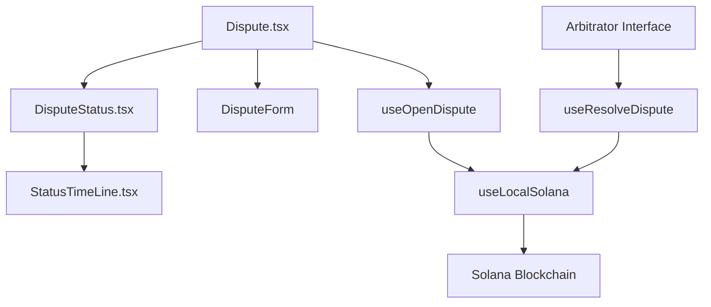

# Dispute System Documentation

## Codebase Organization

### Core Components

#### React Components
- `components/Dispute/Dispute.tsx`: Main dispute interface component that orchestrates the dispute flow
  - Handles display of dispute form, notes, and status
  - Manages user roles (buyer/seller/arbitrator) and their respective views
  - Integrates with token display and dispute status components

- `components/DisputeTrade/DisputeStatus.tsx`: Displays current dispute status and progress
  - Shows different states: pending, resolved (won/lost)
  - Integrates with StatusTimeLine for progress tracking
  - Displays transaction details and dispute outcomes

- `components/DisputeTrade/StatusTimeLine.tsx`: Visual progress indicator for dispute process
  - Shows steps: Counterparty notification, Response status, LocalSolana arbitration
  - Updates based on dispute state and user responses
  - Provides clear progress visualization for users

- `components/Dispute/DisputeCompleted.tsx`: Final dispute resolution view
  - Displays outcome and winner information
  - Shows dispute resolution summary
  - Integrates with rating system

#### Transaction Hooks

- `hooks/transactions/useOpenDispute.ts`: Manages dispute creation
  - Handles blockchain transaction for opening disputes
  - Integrates with Shyft for transaction processing
  - Manages loading and success states

- `hooks/transactions/useResolveDispute.ts`: Handles dispute resolution
  - Processes winner declaration on blockchain
  - Manages fund distribution after resolution
  - Handles transaction state and confirmations

- `hooks/transactions/useLocalSolana.ts`: Core Solana integration
  - Contains dispute-related smart contract interactions
  - Manages PDA (Program Derived Address) for escrow
  - Handles token account management for dispute resolution

### Process Flow

1. **Dispute Initiation**
   - User triggers dispute through `Dispute.tsx`
   - `useOpenDispute` hook creates blockchain transaction
   - Dispute record created in database via API
   - WebSocket notification sent to counterparty

2. **Evidence Submission**
   - Both parties can submit evidence through DisputeForm
   - Files stored at `${DISPUTE_IMAGES_BASE_URL}/${order_id}/${filename}`
   - Comments and evidence tracked in user_disputes table

3. **Arbitration Process**
   - Arbitrator reviews evidence through admin interface
   - `useResolveDispute` hook handles winner declaration
   - Smart contract processes fund distribution
   - Status updates broadcast through WebSocket channels

4. **Resolution**
   - `DisputeCompleted.tsx` shows final outcome
   - Funds automatically distributed based on arbitrator decision
   - Transaction details and resolution stored in database

### Component Interaction



### Security and Access Control

1. **Component Level**
   - Components check user roles before rendering sensitive information
   - Arbitrator-only actions restricted by address check
   - File upload restricted to dispute participants

2. **Hook Level**
   - Transaction hooks verify user permissions
   - Smart contract interactions include signature verification
   - Error handling for failed transactions

3. **Integration Points**
   - WebSocket channels segregated by user role
   - API endpoints enforce access control
   - Smart contract maintains on-chain access rules

## API Overview

The dispute system allows buyers and sellers to open disputes on orders, submit evidence, and have disputes resolved by arbitrators. This document covers the API endpoints, database schema, and integration details.

### Database Schema

#### Disputes Table

```sql
CREATE TABLE public.disputes (
    id bigint NOT NULL,
    order_id bigint NOT NULL,
    resolved boolean DEFAULT false NOT NULL,
    created_at timestamp(6) without time zone NOT NULL,
    updated_at timestamp(6) without time zone NOT NULL,
    winner_id bigint
);
```

#### User Disputes Table

```sql
CREATE TABLE public.user_disputes (
    dispute_id bigint,
    user_id bigint,
    comments string,
    created_at timestamp,
    updated_at timestamp
);
```

#### Dispute Files Table

```sql
CREATE TABLE public.dispute_files (
    id bigint NOT NULL,
    user_dispute_id bigint NOT NULL,
    filename character varying,
    created_at timestamp(6) without time zone NOT NULL,
    updated_at timestamp(6) without time zone NOT NULL
);
```

### API Endpoints

#### Create Dispute

**Endpoint:** `POST /api/disputes/:id`

Creates a new dispute for an order.

**Request Body:**
```json
{
  "winner_id": "bigint (optional)",
  "resolved": "boolean (optional)",
  "comments": "string",
  "files": ["array of filenames"]
}
```

**Response:**
```json
{
  "dispute": "bigint (dispute id)",
  "resolved": "boolean",
  "user_dispute": {
    "id": "bigint",
    "comments": "string"
  },
  "counterpart_replied": "boolean",
  "winner": "bigint (user id)"
}
```

#### Get All Disputes

**Endpoint:** `GET /api/disputes`

Returns all disputes with buyer and seller information.

**Response:**
```json
[
  {
    "id": "bigint",
    "order_id": "bigint",
    "resolved": "boolean",
    "winner_id": "bigint",
    "created_at": "timestamp",
    "updated_at": "timestamp",
    "buyerInformation": {
      "id": "bigint",
      "name": "string",
      "address": "string"
    },
    "sellerInformation": {
      "id": "bigint",
      "name": "string",
      "address": "string"
    }
  }
]
```

#### Get Particular Dispute

**Endpoint:** `GET /api/disputes/:id`

Gets details of a specific dispute by order ID.

**Response:**
```json
{
  "id": "bigint",
  "order_id": "bigint",
  "resolved": "boolean",
  "winner_id": "bigint",
  "created_at": "timestamp",
  "updated_at": "timestamp",
  "user_responses": [
    {
      "dispute_id": "bigint",
      "user_id": "bigint",
      "comments": "string",
      "files": [
        {
          "filename": "string"
        }
      ]
    }
  ]
}
```

#### Update Dispute

**Endpoint:** `PUT /api/disputes`

Updates a dispute's status and winner.

**Request Body:**
```json
{
  "order_id": "bigint (required)",
  "resolved": "boolean (optional)",
  "winner_id": "bigint (optional)"
}
```

**Response:**
```json
{
  "id": "bigint",
  "order_id": "bigint",
  "resolved": "boolean",
  "winner_id": "bigint",
  "created_at": "timestamp",
  "updated_at": "timestamp"
}
```

### Smart Contract Integration

The dispute system integrates with a Solana smart contract for on-chain dispute resolution.

#### Events

1. **DisputeOpened**
```typescript
{
  order_id: string,
  sender: pubkey
}
```

2. **DisputeResolved**
```typescript
{
  order_id: string,
  winner: pubkey
}
```

#### Error Codes

```typescript
{
  6017: "Disputed - This order is disputed. You can't release funds.",
  6018: "InvalidArbitrator - You're not a valid arbitrator.",
  6019: "InvalidAuthority - You're not a seller or buyer for this order."
}
```

### Frontend Integration

#### Order Details Integration

When displaying order details, dispute information is included in the response:

```typescript
interface OrderDispute {
  id: number;
  resolved: boolean;
  user_dispute: {
    id: number;
    comments: string;
  };
  counterpart_replied: boolean;
  winner: number;
}

interface OrderResponse {
  // ... other order fields
  dispute?: OrderDispute[];
}
```

#### File Upload

Dispute evidence files should be uploaded to: `${process.env.DISPUTE_IMAGES_BASE_URL}/${order_id}/${filename}`

#### Arbitrator Access

Special access is granted to the arbitrator address: `4uXATaUbYJjvRu1QfZVBDbhsa8XtDEvUUJWPKanHhsja`

The arbitrator can:
- View all dispute evidence
- Resolve disputes
- Set winners

#### WebSocket Updates

Order updates, including dispute status changes, are broadcast on two channels:
- Buyer channel: `OrdersChannel_${order_id}_${buyer_id}`
- Seller channel: `OrdersChannel_${order_id}_${seller_id}`

Events broadcast include:
- Dispute opened
- Evidence submitted
- Counterparty response
- Dispute resolution
- Fund distribution

### Debugging Tips

1. **Common Issues:**
   - Check if the order exists before creating a dispute
   - Verify user permissions (buyer/seller/arbitrator)
   - Ensure file uploads are in the correct format and location

2. **Useful Queries:**
```sql
-- Check dispute status
SELECT d.*, ud.comments, df.filename 
FROM disputes d
LEFT JOIN user_disputes ud ON d.id = ud.dispute_id
LEFT JOIN dispute_files df ON ud.id = df.user_dispute_id
WHERE d.order_id = [order_id];

-- Check user permissions
SELECT * FROM orders 
WHERE id = [order_id] 
AND (buyer_id = [user_id] OR seller_id = [user_id]);
```

3. **Status Codes:**
   - Order status 5 indicates a dispute is in progress
   - Check both `resolved` flag and `winner_id` for dispute resolution status

4. **File Paths:**
   - Dispute evidence files are stored at: `${DISPUTE_IMAGES_BASE_URL}/${order_id}/${filename}`
   - Ensure the directory exists and has proper permissions

### Security Considerations

1. **Access Control:**
   - Only buyers and sellers can create disputes
   - Only the arbitrator can resolve disputes
   - Users can only view their own dispute evidence (except arbitrator)

2. **File Upload:**
   - Implement proper file type validation
   - Set maximum file size limits
   - Sanitize filenames
   - Files stored securely in AWS S3

3. **Smart Contract:**
   - Verify transaction signatures
   - Check for proper account ownership
   - Handle failed transactions gracefully
   - Validate arbitrator authority

4. **Data Protection:**
   - Encrypt sensitive dispute data
   - Validate user permissions before data access
   - Implement rate limiting on API endpoints
   - Secure file storage and access

5. **Transaction Security:**
   - Validate all blockchain transactions
   - Ensure proper fund locking during disputes
   - Verify signatures for all operations
   - Implement timeouts for unresolved disputes

### Testing Guide

#### Test Scenario Setup

1. **Prerequisites**
   - Three test wallets:
     - Buyer wallet with sufficient funds
     - Seller wallet with tokens to sell
     - Arbitrator wallet (use test arbitrator address)
   - Test order with status = "active"
   - Test tokens or SOL for transactions

2. **End-to-End Test Flow**
   ```
   Create Order -> Mark as Paid -> Open Dispute -> Submit Evidence -> Resolve Dispute
   ```

#### Test Cases

1. **Dispute Creation**
   - Test buyer initiating dispute
   - Test seller initiating dispute
   - Verify WebSocket notifications
   - Check database entries created
   - Validate blockchain transaction success

2. **Evidence Submission**
   - Upload various file types
   - Test file size limits
   - Submit comments
   - Verify counterparty notifications
   - Check AWS S3 storage

3. **Arbitration Process**
   - Test arbitrator access
   - Review evidence visibility
   - Test winner declaration
   - Verify fund distribution
   - Check transaction confirmations

4. **Error Conditions**
   - Invalid file uploads
   - Unauthorized access attempts
   - Network failures
   - Invalid transactions
   - Duplicate disputes

#### Debugging Checklist

1. **Frontend Issues**
   ```
   - Check browser console for errors
   - Verify WebSocket connections
   - Validate form submissions
   - Check file upload progress
   ```

2. **Backend Issues**
   ```sql
   -- Check dispute status
   SELECT * FROM disputes WHERE order_id = [order_id];
   
   -- Verify evidence upload
   SELECT * FROM dispute_files WHERE dispute_id = [dispute_id];
   
   -- Check user permissions
   SELECT * FROM user_disputes WHERE dispute_id = [dispute_id];
   ```

3. **Blockchain Issues**
   ```typescript
   // Verify transaction status
   const tx = await connection.getTransaction(signature);
   
   // Check escrow account
   const escrowAccount = await program.account.escrow.fetch(escrowPDA);
   
   // Validate arbitrator
   const isArbitrator = publicKey.equals(new PublicKey(process.env.ARBITRATOR_ADDRESS));
   ```

#### Common Issues and Solutions

1. **Transaction Failures**
   - Check wallet balances
   - Verify correct account permissions
   - Ensure proper transaction signing
   - Validate PDAs and token accounts

2. **File Upload Issues**
   - Verify AWS credentials
   - Check file size and type restrictions
   - Ensure proper directory permissions
   - Validate file paths

3. **Permission Issues**
   - Verify user roles
   - Check arbitrator address
   - Validate order ownership
   - Confirm transaction authority

4. **Data Synchronization**
   - Check WebSocket connections
   - Verify database updates
   - Validate blockchain state
   - Confirm event broadcasts

#### Monitoring Tools

1. **Transaction Monitoring**
   - Solana Explorer for transaction status
   - Shyft dashboard for transaction history
   - Local logs for transaction details

2. **Database Monitoring**
   - Check dispute table updates
   - Monitor file upload records
   - Track user responses
   - Verify timestamps

3. **Error Tracking**
   - Browser console logs
   - Server error logs
   - Blockchain transaction logs
   - AWS S3 upload logs
