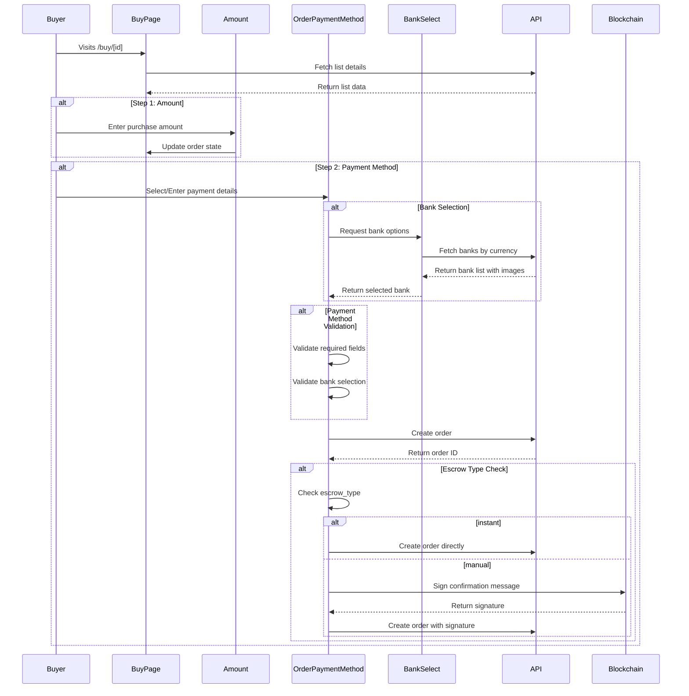

# Order/Buy Process Documentation

## Overview

The order/buy process allows users to purchase crypto from sellers' listings. The process is split into multiple steps and involves several components working together.

> **Implementation Note:** Current implementation in `pages/buy/[id].tsx` needs updating to handle new bank image fields and escrow types.

## Flow Diagram



> **Implementation Note:** Current flow in `OrderPaymentMethod.tsx` doesn't fully implement the bank selection validation steps shown above.

## Components Structure

### 1. BuyPage (`pages/buy/[id].tsx`)
- Entry point for the buying process
- Manages the overall state via `UIOrder`
- Controls step navigation
- Fetches initial list data
- Key state:
  ```typescript
  const [order, setOrder] = useState<UIOrder>({ 
    step: AMOUNT_STEP,
    escrow_type: list.escrow_type // Currently missing
  } as UIOrder);
  ```

### 2. Amount Component (`components/Buy/Amount.tsx`)
- Step 1 of the process
- Handles amount input and validation
- Calculates token amounts based on price
- Updates parent state via `updateOrder`

### 3. OrderPaymentMethod (`components/Buy/OrderPaymentMethod.tsx`)
- Step 2 of the process
- Manages payment method selection and input
- Handles order creation
- Key features:
  - Bank selection
  - Payment details form
  - Order creation
  - Message signing for non-instant escrow

> **Implementation Note:** Current implementation uses type assertions that should be replaced with proper type checking.

## Data Models

### Current API Models
```typescript
interface Bank {
    id: number;
    name: string;
    color: string;
    account_info_schema: AccountSchema[];
    imageUrl: string;
    icon?: string;
    image?: string;
    code?: string;
}

interface PaymentMethod {
    id: number;
    bank: Bank;
    bank_id: number;
    values: AccountFieldValue;
}

interface AccountFieldValue {
    [key: string]: string | undefined;
}

interface UIOrder {
    step: number;
    list: List;
    listId: number;
    fiat_amount?: number;
    token_amount?: number;
    price?: number;
    paymentMethod?: PaymentMethod;
    bankId?: number;
    escrow_type: 'instant' | 'manual';
}
```

> **Implementation Note:** Current `models/types.ts` needs updating to match these interfaces.

## API Integration

### 1. List Fetching
```typescript
// GET /api/lists/${id}
interface ListResponse {
    data: {
        id: number;
        fiat_currency: FiatCurrency;
        type: string;
        bank: Bank[];
        token: Token;
        escrow_type: 'instant' | 'manual';
    }
}
```

### 2. Bank Fetching
```typescript
// GET /api/banks?currency_id=${currencyId}
interface BankResponse {
    data: Bank[];
}
```

### 3. Order Creation
```typescript
// POST /api/createOrder/
interface OrderCreationPayload {
    listId: number;
    fiatAmount: number;
    tokenAmount: number;
    price: number;
    paymentMethod: PaymentMethod;
    buyer_id: string;
}
```

> **Implementation Note:** Current API calls in `OrderPaymentMethod.tsx` need updating to handle error responses properly.

## Key Features

### 1. Bank Image Handling
- Primary: Use `imageUrl` field
- Fallback 1: Use `icon` field
- Fallback 2: Construct URL from `image` field
- Final fallback: Display color block

### 2. Escrow Type Handling
- Instant Escrow: Direct order creation
- Manual Escrow: Requires message signing
- Uses `useConfirmationSignMessage` hook

### 3. Payment Method Validation
```typescript
const resolver = () => {
    const error: Errors = {};
    if (!bank?.id) {
        error.bankId = 'Should be present';
    }
    schema.forEach((field) => {
        if (field.required && !values[field.id]) {
            error[field.id] = `${field.label} should be present`;
        }
    });
    return error;
};
```

## Error Handling

### API Error Responses
```typescript
interface APIError {
    error: string;
    code: string;
    details?: Record<string, string[]>;
}
```

Common error codes:
- `INVALID_BANK`: Bank selection invalid
- `INVALID_PAYMENT_METHOD`: Payment method validation failed
- `INSUFFICIENT_FUNDS`: Escrow amount not available
- `UNAUTHORIZED`: Authentication failed

> **Implementation Note:** Error handling needs to be implemented consistently across all API calls.

## Security Considerations

1. **Authentication**
   - All API calls require authentication token
   - Buyer address verification

2. **Data Validation**
   - Input validation before submission
   - Schema-based validation for payment details

3. **Blockchain Integration**
   - Message signing for non-instant escrow
   - Transaction amount validation

## Known Limitations

1. **Error Handling**
   - Some API calls lack comprehensive error handling
   - Need for better error messaging

2. **Type Safety**
   - Some components use type assertions
   - Inconsistent typing between UI and API models

3. **State Management**
   - Complex state management in parent component
   - Potential for prop drilling

## Recommendations

1. **Error Handling**
   - Add comprehensive error handling for API calls
   - Implement consistent error messaging

2. **Type Safety**
   - Remove type assertions
   - Align UI and API type definitions

3. **State Management**
   - Consider using context or state management library
   - Implement proper loading states

4. **Testing**
   - Add unit tests for critical flows
   - Implement E2E testing for complete buy process

> **Implementation Note:** These recommendations should be prioritized based on current development roadmap.

